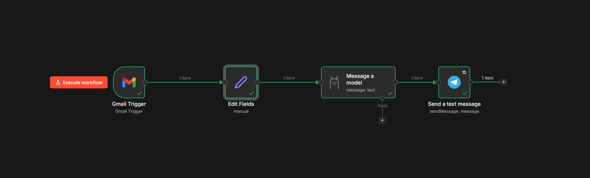
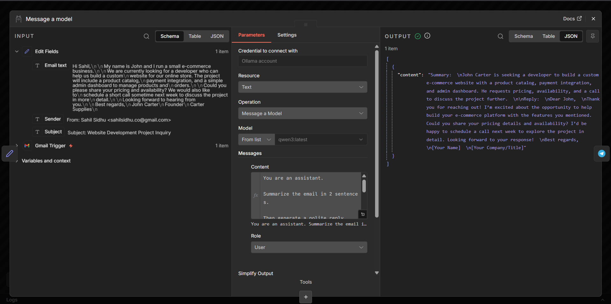
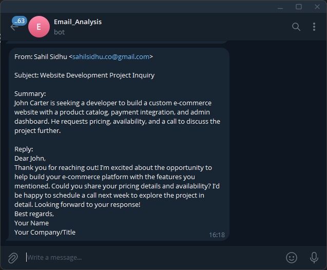

# AI Email Assistant (n8n + Ollama)

An AI-powered email automation workflow built using **n8n** and **Ollama**.

This workflow automatically detects new emails, summarizes them using AI, and generates a suggested reply.

## 🚀 Features

- Detects incoming emails automatically
- Uses AI to summarize email content
- Generates a professional reply draft
- Sends the summary to Telegram (optional)
- Fully automated workflow

## 🧠 Use Case

Businesses receive hundreds of emails daily.  
This automation helps by:

- summarizing emails instantly
- drafting replies
- reducing manual effort

Perfect for:

- customer support
- founders
- sales teams
- freelancers

---

# Screenshots

Screenshot 1 - n8n Canvas

Screenshot 2 - Ollama Node

Screenshot 3 - Telegram message

---

# ⚙️ Tech Stack

- n8n (workflow automation)
- Gmail API
- Ollama
- Telegram (optional)

---

# 🔄 Workflow Architecture

Gmail Trigger

↓

Extract Email Content

↓

Ollama (Summarize + Reply)

↓

Send Notification (Telegram)

---

# 🛠 Setup Instructions

### 1 Install n8n

npm install n8n -g

Run locally:

n8n

Open:

http://localhost:5678

---

### 2 Import Workflow

Download and import:

workflow.json

---

### 3 Connect APIs

You must connect:

- Gmail
- Ollama
- Telegram (optional)

---

### 4 Activate Workflow

Once activated, the workflow automatically runs when a new email arrives.

---

# 🧪 Example Output

### Email Summary

Summary:
The sender is asking about pricing for a web development project and wants to schedule a call next week.

### AI Generated Reply

Reply:
Hi John,

Thank you for reaching out! I'd be happy to discuss your project requirements and pricing. Please let me know a convenient time next week for a quick call.

Best regards,
Sahil

---

# 📸 Demo

Add screenshots here:

- Workflow in n8n
- AI generated summary
- Notification message

---

# 💡 Future Improvements

- Gmail auto-reply
- CRM integration
- AI classification (support / sales / spam)
- Priority detection

---

# 👨‍💻 Author

Sahilpreet Singh Sidhu

Skills:
- AI Automation
- Full Stack Development
- Python
- SQL
- n8n workflows
